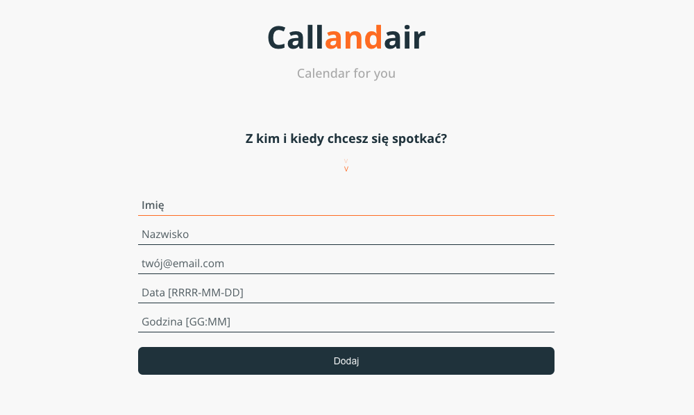
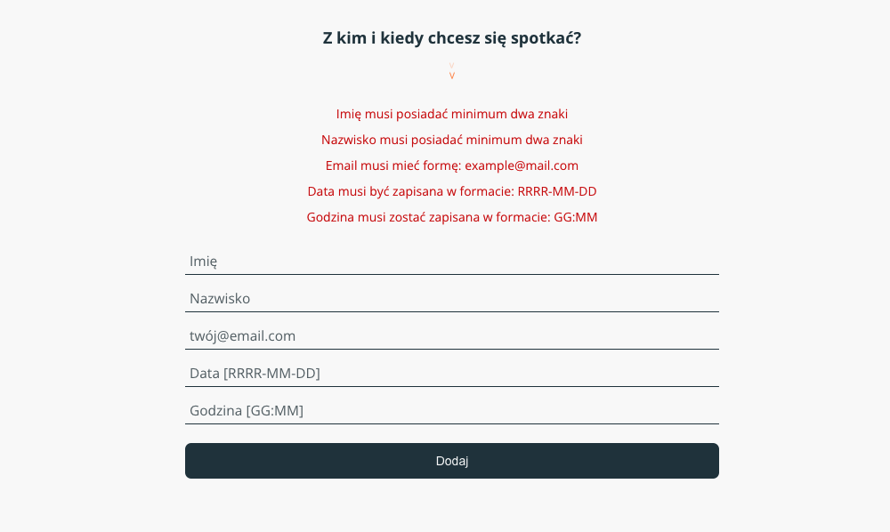
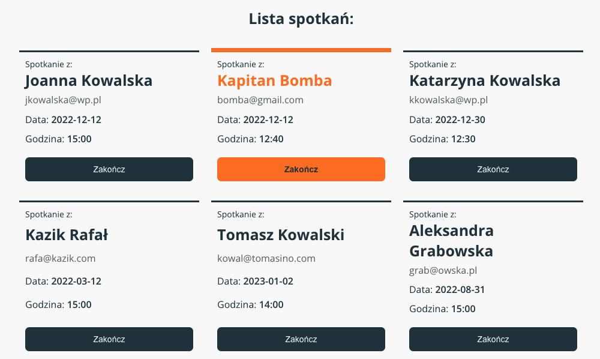

# React Meeting Calendar

## :technologist: Technologies and metodologies

Technologies and metodologies used in this project:

**React / CSS / BEM / RWD /
Fetch / JSON Server**

<!-- #### :clapper: Check live version: **[LIVE](https://rafalkazik.github.io/github-repo-search/)** -->

## :gear: Installation

The project uses [node](https://nodejs.org/en/) and [npm](https://www.npmjs.com/). To run the app on your device you should install all dependencies. Then create a localhost port and run your web explorer.

Let's start with installing all dependencies. Move to the app main workspace and run:

    npm i

To create a localhost port you should type:

    npm start

Our repositories search engine is ready at port 3000.

    http://localhost:3000/

You need to run our JSON server also:

    json-server --watch ./src/db/data.json --port 3005

## :microscope: How it works?

### :point_right: Add your meeting

Enter the first name, last name, email address of the person you are planning the meeting with and also the date and time of the meeting.

### :exclamation: Form validation :exclamation:

To submit the form, your data should have the correct format:

- first name and last name should contain at least two characters;
- the e-mail address should be in the following format: **name@email.com**;
- the date should be in the format: **YYYY-MM-DD**
- the time should be entered in the format: **HH: MM**.

### :x: End the meeting

After the meeting or if your plans have changed, end the meeting by clicking the button below the meeting.

## :mailbox: Feel free to contact me

You can find me on **[LINKEDIN](https://www.linkedin.com/in/rafa%C5%82-kazik-924b8710a/)**
